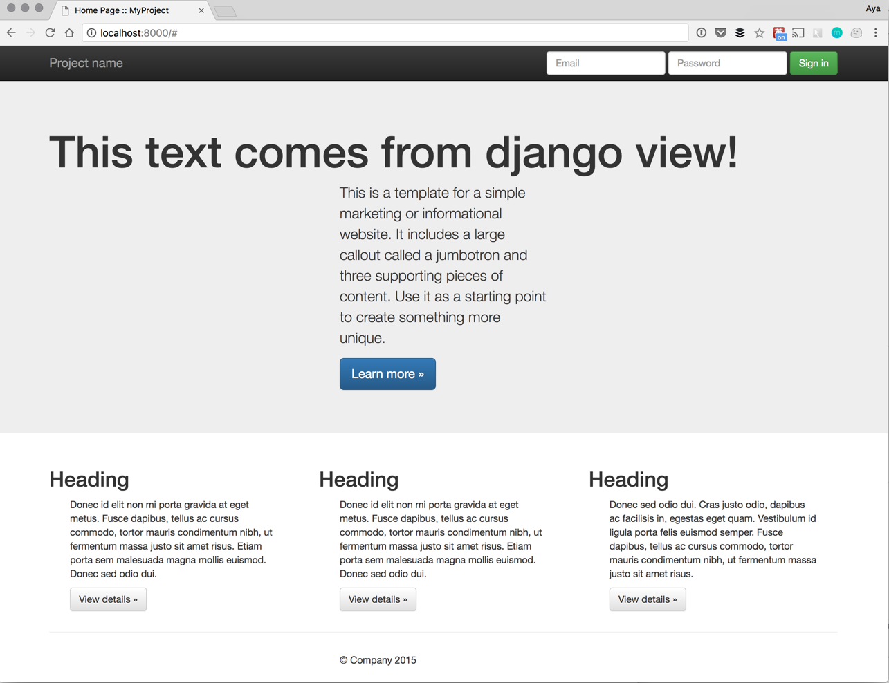

# Simple Web application



## Getting started

1. Clone sample apps

   ``` shell
   $ git clone https://github.com/cloud-hackathon/python-apps.git
   ```

2. Move to `django-plane` directory
3. Run application

   ``` shell
   $ docker-compose up
   ```
   
> To rebuild image you must use `docker-compose up --build`.
   
4. Access `<host address>:8080` on browser
